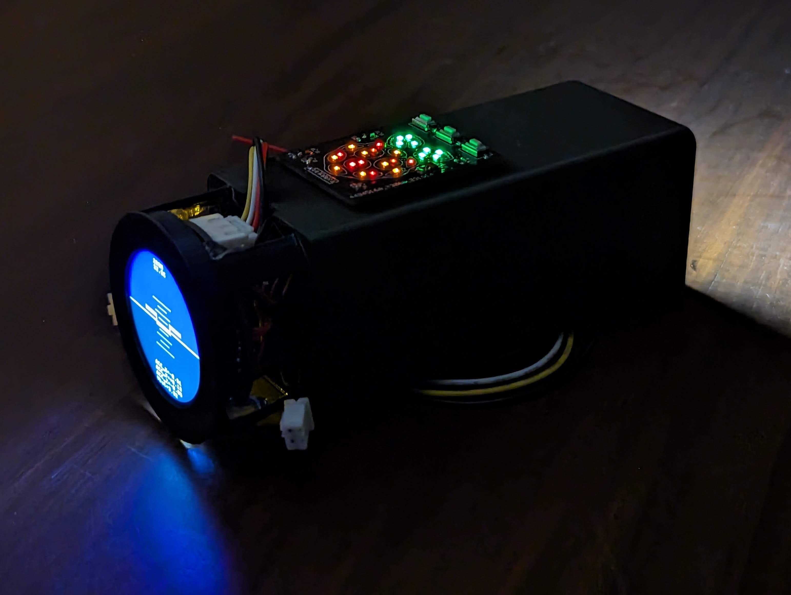

# Attitude-indicator

Attitude indicator is a versatile portable battery powered device designed to aid in applications where monitoring, data logging and alerts are required. It operates with a microcontroller for processing, a round display for visual information, electromagnetic buzzer for sound alerts, push buttons for user input, long-range (Lo-Ra) wireless transceiver, micro SD card for data logging, a range of sensors, and a usb-c port for charging.

key applications:
- Drone monitoring: Wireless aircraft attitude and flight data indicator with sound alerts for low battery, sharp roll/pitch angles etc.
- Flashlight: Works as a simple flash light with 20+ hours of battery life.
- Lo-Ra Radio Communication: Acts as a transmitter and receiver for Lo-Ra radio messages.
- Data Display: Shows altitude, temperature, speed, and GPS coordinates data using built-in sensors.

